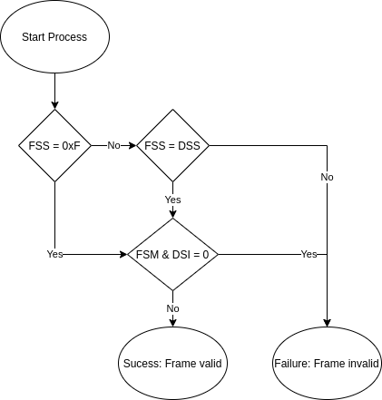

:xrefstyle: short
:sectnums:

= DASH7 Alliance Protocol v1.3
:toc:
:toclevels: 4

== Legal Notice
== Intellectual Propery Right Claims
=== DASH7 IPR Policy
=== IPR Claims
== Scope
== Overview
== Physical Layer
== Data Link Layer
=== Hosts
==== Device Input
==== Device Output
=== Timing Units
==== Tick
==== Compressed Format
=== Frame structure

Two types of frames are defined: background and foreground. Background frames contain a Sync Word of Class 0.
Foreground frames contain a Sync Word of Class 1. Foreground Frames are of variable length, up to 256 bytes. The
structure of the Foreground Frame is defined in xref:table:dll-frame[].

[#table:dll-frame]
.Data Link Foreground Frame Structure
[cols="8*"]
|===
|PHY Header |Length |Subnet |CTRL |TADR |Payload |CRC16 |PHY Footer 

|
|1 byte
|1 byte
|1 byte
|0/1/2/8 bytes
|0-251 bytes
|2 bytes
|
|===

The first data byte of the frame is a *length* parameter, which measures the total number of bytes in the frame,
excluding the length byte itself and including the CRC bytes. The *subnet* is defined in xref:sect:subnet[]. The *CRC16* is
defined in xref:sect:CRC16[]. The *Control* parameter is composed of 1 byte defined in xref:table:dll-frame-ctrl[].

[#table:dll-frame-ctrl]
.Data Link Foreground Frame Control Byte
[cols="1h,1h,3"]
|===
|b7-b6
|ID_TYPE
|Target ID identifier type ()
|b5-b0
|EIRP_I
|EIRP index ranged [0, 63]. EIRP (dBm) = (EIRP_I – 32) dBm
|
|===

Backgroud frames are of fixed length as defined in xref:table:dll-frame-bg[].

[#table:dll-frame-bg]
.Data Link Background Frame Structure
[cols="6*"]
|===
|PHY Header |Subnet |CTRL |Payload |CRC16 |PHY Footer 

|
|1 byte
|1 byte
|2 bytes
|2 bytes

|
|===

The *subnet* is defined in xref:sect:subnet[]. The *CRC16* is defined in xref:sect:CRC16[]. The *control* parameter is composed of 1 byte defined in xref:table:dll-frame-bg-ctrl[].

[#table:dll-frame-bg-ctrl]
.Data Link Background Frame Control Byte
[cols="1h,1h,3"]
|===
|b7-b6
|ID_TYPE
|Target ID identifier type ()
|b5-b0
|TAG
|Identifier Tag (xref:sect:identifier-tag[])
|
|===

==== ID Structure

D7A devices keep a set of DLL addresses, referred to as Device ID. D7A uses a Device ID structure compliant with
ISO 15963, manifested in a fixed-value Unique ID (UID) and a dynamic-value Virtual ID (VID).

==== Unique ID (UID)
==== Virtual ID (VID)
[#sect:identifier-tag]
==== Identifier Tags
=== Data Link Filtering
[#sect:CRC16]
==== CRC16 Validation
[#sect:subnet]
==== Subnet Matching
The Subnet is an 8 bit value that allows configurable, data-based filtering of incoming frames. 
Each device contains an internal subnet value (the Device Subnet) that is compared with the value of the incoming frame (Frame Subnet).
The structure is show in xref:table:dll-subnet[]. 
The upper 4 bits of the Subnet contain a specifier, which must be matched exactly, or be valued 0xF, which is universally accepted. 
The lower 4 bits of the Subnet form a property identifier.
The device subnet identifier and frame subnet mask are logically anded, and compared. The process for accepting a frame via Subnet value is shown in xref:img:dll-subnet-filtering-process[].

[#table:dll-subnet]
.Subnet ID Construction
[cols="1,1"]
|===
|Specifier |Mask / Indentifier

a|
[cols="4*"]
!===
! b7
! b6
! b5
! b4

!===

a|
[cols="4*"]
!===
! b3
! b2
! b1
! b0

!===

|===

.Subnet Filtering Process
[#img:dll-subnet-filtering-process]
  
==== Link Quality Assessment
==== Foreground Device ID Filter
==== Background Device ID Filter
=== Access Profile
